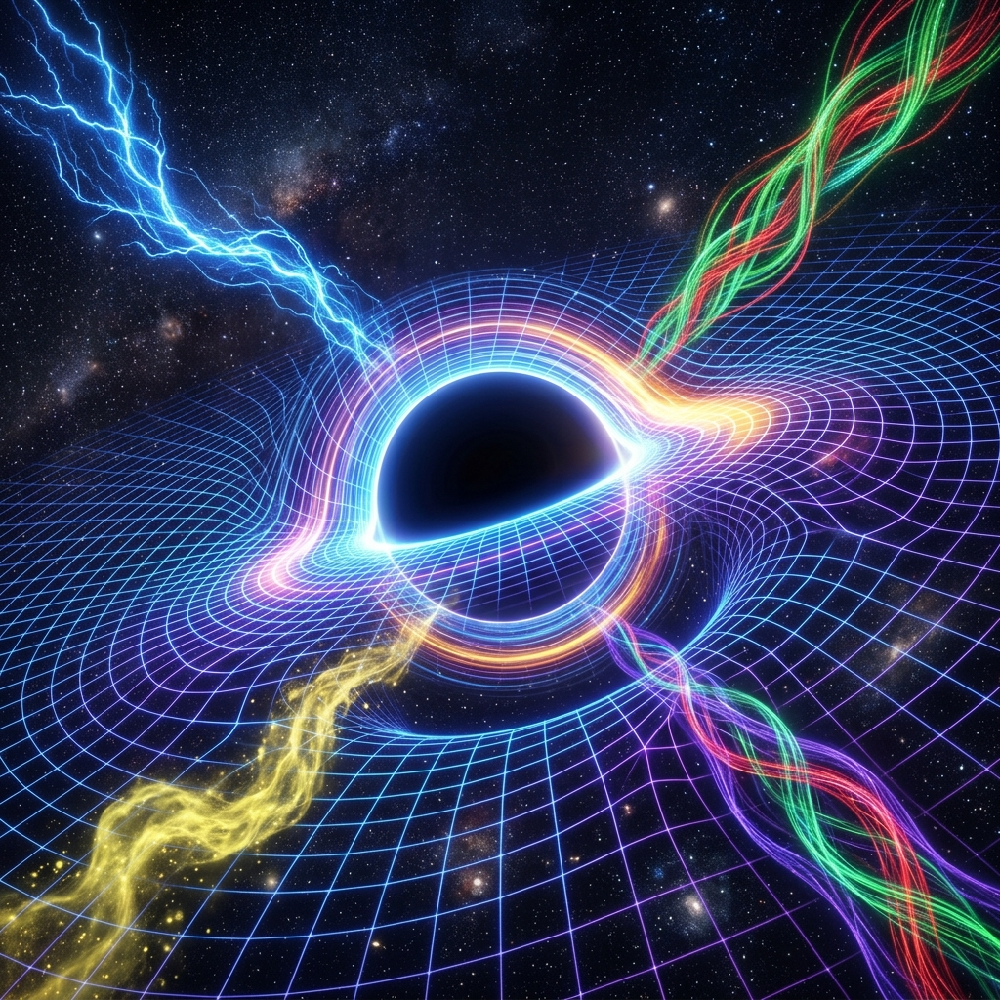

# 대통일장 이론 및 모든 것의 이론 (GUT & ToE) 연구 라이브러리

<section class="hnm-hero">
  

    
Horizon Noncommutative Matrix Theory

    <h2>하나의 유한한 지평선 대수, 하나의 스펙트럼 작용량, 여러 유효 힘.</h2>
    

      <a href="#view=theory-map" data-view-target="theory-map">인터랙티브 이론 맵 열기</a>
      <a href="#doc=hnm_research_summary.md">압축 요약본 읽기</a>
    

    

      HNM은 하나의 모든 것의 이론 후보로 정리된다. 지평선 정보량으로 제한되는
      유한한 비가환 행렬 대수에서 출발하고, 단일 슈퍼 디랙 스펙트럼 데이터로
      동역학을 정의한 뒤, 시공간과 게이지 장, 우주론, 관측 신호를 같은 행렬계의
      서로 다른 유효 층위로 해석한다.
    

  

  <figure class="hnm-hero-figure">
    
    <figcaption>네 가지 상호작용은 하나의 지평선 규모 행렬 동역학이 서로 다르게 투영된 유효 현상으로 해석된다.</figcaption>
  </figure>
</section>

본 저장소는 **지평선 비가환 행렬 이론(Horizon Noncommutative Matrix Theory, HNM)**을 모든 것의 이론 후보로 정리하기 위한 웹 중심 연구 라이브러리입니다.

기존 통합 이론의 성과와 병목을 비교한 뒤, HNM 제안을 공리에서 관측 가능 신호까지 하나의 일관된 논리 사슬로 제시하는 것을 목표로 합니다.

---

## HNM 한눈에 보기

  

    공리
    <strong>슈퍼 디랙 연산자</strong>
    <em>유한한 비가환 행렬 대수 위의 단일 스펙트럼 데이터.</em>
  

  
→

  

    한계
    <strong>지평선 정보량</strong>
    <em>관측 가능한 자유도는 무한 연속체가 아니라 지평선 정보 용량으로 제한된다.</em>
  

  
→

  

    동역학
    <strong>행렬 작용량</strong>
    <em>큰 N 극한에서 교환자는 곡률, 게이지 장, 물질 결합으로 해석된다.</em>
  

  
→

  

    창발
    <strong>시공간과 입자</strong>
    <em>D=10 일관성, 퍼지 콤팩트화, 우주론, ER=EPR, 모듈러 시간이 한 축으로 연결된다.</em>
  

  
→

  

    검증
    <strong>반증 가능한 신호</strong>
    <em>최소 길이 보정, 면적 양자화, 청색 기울기 원시 중력파, 홀로그래픽 노이즈.</em>
  

**엘리베이터 해석.** HNM은 사건의 지평선을 정보 경계로 보고, 무한히 매끄러운 배경 시공간 대신 유한한 행렬을 기본 대상으로 삼는다. 중력, 게이지 힘, 입자 세대, 우주 팽창, 얽힘 기하를 하나의 지평선 제한 행렬 동역학의 서로 다른 극한으로 읽을 수 있는지 묻는 이론이다.

**읽기 기준.** 풀버전 이론서의 정리/증명 표현은 내부 수학 전개를 뜻한다. 경험적 주장과 정량 신호는 독립 검증 전까지 제안된 예측 및 일관성 목표로 읽어야 한다.

---

## 📁 연구 문서 구조 (Research Directory)

본 라이브러리는 이론의 통합 단계 및 패러다임에 따라 다음과 같이 구성되어 있습니다. 웹 포털에서는 아래 항목을 눌러도 원문 markdown 파일로 이동하지 않고, 좌측 메뉴와 동일하게 같은 문서 뷰어 안에서 열립니다.

### [01. 전기약작용 이론 (Electroweak Theory)](#doc=01_electroweak_theory.md)
* **주제**: 전자기력(QED)과 약한 상호작용의 통합 ($SU(2)_L \times U(1)_Y$ 게이지 대칭성)
* **주요 내용**: 힉스 메커니즘을 통한 자발적 대칭성 깨짐, 게이지 보손($W^\pm, Z^0$) 질량 획득, 표준모형의 성공과 계층 문제(Hierarchy Problem).

### [02. 대통일장 이론 (Grand Unified Theories, GUT)](#doc=02_grand_unified_theories.md)
* **주제**: 전기약작용과 강한 상호작용의 대통일 게이지 이론
* **주요 내용**: 최소 $SU(5)$ 조지-글래쇼 모형, $SO(10)$ 대칭성과 중성미자 질량(시소 메커니즘), 초대칭 대통일 이론(SUSY GUT), 양성자 붕괴(Proton Decay)의 실험적 한계.

### [03. 양자 중력 및 모든 것의 이론 (Quantum Gravity & ToE)](#doc=03_quantum_gravity_toe.md)
* **주제**: 대통일장과 중력의 통합 (양자역학과 일반 상대성 이론의 융합)
* **주요 내용**:
  * 왜 두 이론은 미시 세계에서 충돌하는가 (비재규격화 문제).
  * **초끈 이론 및 M-이론**: 10/11차원 시공간, 칼라비-야우 다양체 콤팩트화 및 랜드스케이프 문제.
  * **루프 양자 중력 (LQG)**: 공간의 양자화(스핀 네트워크), 배경 독립성(Background Independence)과 저에너지 극한의 문제.

### [04. 대안적 패러다임 및 정보 물리학 (Alternative Paradigms)](#doc=04_alternative_paradigms.md)
* **주제**: 기존 끈 이론과 루프 중력의 교착 상태를 타개하기 위한 최신 연구 트렌드
* **주요 내용**: 에릭 벌린데의 엔트로피 중력(Entropic Gravity), 홀로그래피 원리(AdS/CFT 대응성), ER=EPR 가설(양자 얽힘과 웜홀), 휠러의 "It from bit" 정보 물리학.

### [05. 블랙홀 우주론 및 지평선 홀로그래피 (Black Hole Cosmology & Horizon Holography)](#doc=05_black_hole_cosmology.md)
* **주제**: 우리 우주가 블랙홀 내부에 존재하거나 지평선 자체에 걸쳐 있다는 가설적 패러다임 분석
* **주요 내용**: 우주의 슈바르츠실트 임계 조건 일치 검증, 포프랍스키의 비틀림(Torsion) 빅뱅 차단 모델, 베켄슈타인-호킹 지평선 엔트로피에 기초한 홀로그래피 양자 통합 가능성 및 ToE 적용 제언.

### [06. HNM 풀버전 이론서](#doc=06_horizon_unification_math.md)
* **주제**: "스펙트럼 슈퍼 디랙 공리"로부터 유도되는 10차원 비가환 초대칭 행렬 우주론의 전체 수학적 공식화
* **주요 내용**:
  - **스펙트럼 슈퍼 디랙 공리**: 단 하나의 슈퍼 디랙 연산자 $\mathcal{D}$와 그 4차 스펙트럼 작용량 $S[\mathcal{D}] = \text{Tr}_{\text{s}}(\mathcal{D}^4)$로부터의 보손-페르미온 HNM 작용량 유도 및 벌크 우주 상수의 오프셸 영(0)화 소멸 논증.
  - **D=10 차원 유일성**: Fierz 항등식과 팔원수 노름 나눗셈 대수(Hurwitz 정리) 및 Majorana-Weyl 조건의 연역.
  - **드 시터 팽창 ($q \to -1$)**: 행렬 포크 공간에서의 고유값 터널링에 의한 창발적 우주론적 역사로, 점근적인 드 시터 팽창($q_{\text{vacuum}} = -1$) 및 오늘날의 관측 정합적인 감속 매개변수($q_0 \approx -0.55$)를 자연스럽게 유도.
  - **빅 바운스 (Big Bounce)**: 판데르몬데 결정행렬(Vandermonde Jacobian)의 로그 쿨롱 반발력에 의한 빅뱅 특이점 영(0)확률 빅 바운스 시나리오.
  - **Fuzzy 콤팩트화**: $CP^2_F \times S^2_F$ 진공의 Hessian 안정성($m^2>0$), 게이지 창발 및 3세대 소립자 오일러 지수($\chi=3$) 유도.
  - **ER=EPR 및 암흑 물질**: 비대각 블록 얽힘에 의한 웜홀 기하 창발 및 최고차 Kaluza-Klein 잔존 모드(KK Remnants)의 동치 정식화.

### [HNM 압축 요약본](#doc=hnm_research_summary.md)
* **주제**: 풀버전 HNM 이론서의 내용을 웹에서 빠르게 읽을 수 있도록 압축한 요약본이며, 별개의 주장 체계가 아니다.
* **주요 내용**: 풀버전과 같은 순서로 슈퍼 디랙 공리, 지평선 정보 한계, 행렬 포크 공간 팽창, 마스터 작용량, 워드 항등식에 의한 진공 에너지 상쇄, 고전 극한, $D=10$ 일관성, 표준모형 콤팩트화, 우주론, ER=EPR, 모듈러 시간, 정량 예측, 끈 이론의 창발을 요약한다.

---

## 🛠️ 연구의 출발점: 기존 한계 요약

기존 연구들을 센싱한 결과, 우리가 해결해야 할 핵심 병목 현상은 다음과 같습니다.

1. **에너지 스케일의 극단성 (The Planck Barrier)**:
   대통일(GUT) 에너지는 $\sim 10^{16}\text{ GeV}$, 플랑크(Quantum Gravity) 에너지는 $\sim 10^{19}\text{ GeV}$로, 현재 인류 최첨단 가속기인 LHC($\sim 13\text{ TeV} = 1.3 \times 10^4\text{ GeV}$)의 능력을 크게 넘어섭니다. 즉, **직접적인 가속기 충돌 실험을 통한 검증은 현 기술로는 현실적이지 않습니다**.
2. **배경 의존성 vs 배경 독립성의 모순**:
   시공간을 고정된 그릇으로 볼 것인가(양자장론, 끈이론), 아니면 시공간 자체가 물리적 상호작용으로 생성되는 결과물로 볼 것인가(일반상대론, 루프중력)에 대한 철학적·수학적 타협점이 없습니다.
3. **자연스러움(Naturalness)과 미세 조정(Fine-tuning)**:
   우주의 상수가 왜 지금의 값을 갖는지 물리 법칙 자체적으로 유도하지 못하고, 다중우주를 도입하여 임의로 선택되었다고 주장하는 인류 원리(Anthropic Principle)적 한계에 봉착해 있습니다.

---
*새로운 아이디어를 구상하시거나 특정 영역의 정밀 식(Equation) 유도가 필요하실 때, 각 문서 내부의 수식 연구 및 분석을 점진적으로 확장해 나가도록 하겠습니다.*
